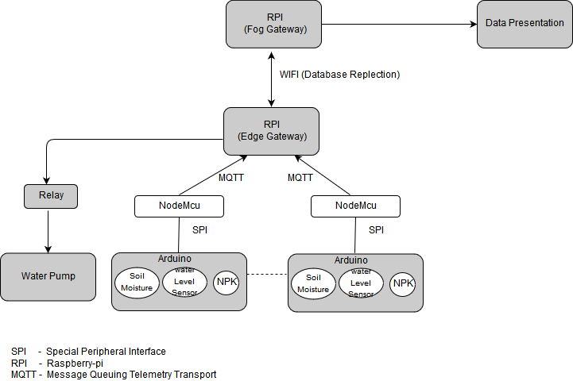

# IoT-Based-Smart-Irrigation

Smart Farming by developing recommendation based system and automate the irrigation process with the help of IOT (Arduino, Raspberry pi, Sensors and Actuators) and weather forecasted data.

